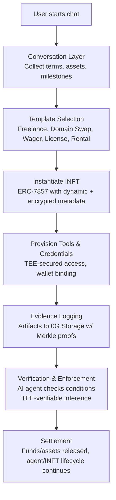

# 🟦 Pacter – Programmable Trust Protocol

> **Autonomous agreements. Verifiable enforcement. No intermediaries.**
>
> Next.js/yarn · Powered by 0G Compute, Storage & Chain

---

## 🚀 Overview

**Pacter** enables anyone to create, manage, and enforce digital pacts using autonomous AI agents. These agents are deployed as Intelligent NFTs (INFTs) on the 0G blockchain, combining on-chain security, transparent AI-powered logic, and tamper-proof storage for digital agreements.

Whether for freelance work, domain trades, digital wagers, IP licensing, or rentals, Pacter gives everyone instant access to programmable trust—no more relying on centralized platforms or human middlemen.

---

## 📊 Architecture & Flow


### **How it works at a glance:**
1. **User starts chat:** Contract terms, assets, milestones are gathered conversationally.
2. **Template selection:** The best-fit agent template is chosen: e.g., Freelance, Wager, Domain Swap, License, Rental.
3. **INFT instantiation:** ERC-7857 INFT created with dynamic, encrypted agent metadata.
4. **Agent provisioning:** TEE-secured credentials/tools, linked wallet.
5. **Evidence logging:** Every artifact to 0G Storage (with Merkle proofs for transparency).
6. **Enforcement:** AI agent validates evidence, enforces logic—all TEE-verifiable via 0G Compute.
7. **Settlement:** Funds/assets are auto-released; the INFT lifecycle continues, ready for re-use or transfer.

---

## 🛠️ **Quickstart (for Devs)**

### **1. Clone & Install**

```bash
git clone https://github.com/YOUR-ORG/pacter.git
cd pacter
yarn install
```

### **2. Environment Setup**

- Copy `.env.example` to `.env.local` and fill in required values:
  - `NEXTAUTH_SECRET=`
  - `NEXT_PUBLIC_0G_PROJECT_ID=`
  - `NEXT_PUBLIC_INF_PROVIDER_URL=`
  - `0G_CHAIN_RPC=`
  - ...see `.env.example` for details.

### **3. Start the Dev Server**

```bash
yarn dev
```

---

## 🌐 **What Pacter Enables**

- **Trustless escrow, payouts, and asset transfers.**
- **AI-enforced contract verification.**
- **Custom, templatized contract logic—deploy new agent logic without a full redeploy.**
- **Audit logs, evidence, and agent outputs are stored on-chain/off-chain with privacy and immutability.**

---

## 💡 **Hero Use Cases (Deep Dive)**

### 1. **Freelance Milestone Contracts**
- **Pain Point:** Freelancers/clients want milestone payouts without Upwork/Fiverr.
- **Pacter Solution:**  
  1. User defines milestones and evidence method (e.g., GitHub commits).
  2. Funds deposited up front in an INFT vault.
  3. AI agent checks milestones as work is submitted, releases partial payouts per milestone.
  4. All proofs/evidence are logged to 0G Storage, audit-ready.
- **Innovation:** Automated milestone validation, support for web/code/file proofs, no platform take rate.

---

### 2. **Domain/Asset Swaps**
- **Pain Point:** Safe, peer-to-peer domain transfers require costly brokers.
- **Pacter Solution:**
  1. Buyer deposits payment; seller transfers asset (domain, license, code).
  2. Agent (with oracle/plugins) verifies transfer and registry status.
  3. On success, swaps assets/funds.
- **Innovation:** Agent-controlled account (e.g., TEE-owned GitHub for code transfers), end-to-end on-chain finality.

---

### 3. **Peer-to-Peer Wagers**
- **Pain Point:** Trustless online betting usually involves custodians or opaque platforms.
- **Pacter Solution:**
  1. Any user creates a social wager (anything verifiable online).
  2. Counterparties deposit stakes into a pooled contract.
  3. Agent verifies outcome via oracle/screenshots/API and pays out winner.
  4. Wage template creators can be rewarded a protocol fee.
- **Innovation:** Extensible wager templates, open to the world, with shareable/tunable logic.

---

### 4. **Digital Licensing/Royalties**
- **Pain Point:** Managing digital rights, license expiry, and royalties is manual and often unenforced.
- **Pacter Solution:**
  1. Artists/owners mint license agents as INFTs.
  2. Agents handle access, verify usage/event triggers, and automatically split/stream royalties.
- **Innovation:** Programmable license logic, cross-market enforcement, all with audit trails.

---

### 5. **NFT/Asset Rentals**
- **Pain Point:** Borrowing/lending NFTs is risky—time-based or "return" enforcement is hard.
- **Pacter Solution:**
  1. Asset is custodied in the INFT vault for a fixed term.
  2. Renter pays; access is given/revoked via agent logic.
  3. Agent ensures timely return (or clawback)—all conditions enforced.
- **Innovation:** Time-based, automated access management, programmable for any digital property.

---

### **More Possible Verticals**
- API quota management, SaaS subscriptions, gaming rewards, hackathon bounties, group fundraising, digital event ticketing, data exchange deals, influencer marketing, online learning credentialing, etc.

---

## 🧑‍💻 **Core Technology Stack**

- **Next.js + Tailwind CSS:** Fast, modern frontend.
- **LangGraph:** Open-source agent orchestration for conversational intake and branching flows.
- **0G Compute SDK:** TEE-backed LLM/AI agent execution, inference, and audit.
- **0G Storage SDK:**  
  - **Log Layer:** Write-only event logs for full transparency.  
  - **KV Layer:** Efficient, updatable contract/session objects.
- **INFTs (ERC-7857 / thirdweb):** Tokenized, programmable agents powered by upgradable logic, workflow templates, and secure access controls.
- **EVM Contracts:** For custody, settlement, vaults, and pooled agreement types.
- **WalletConnect:** User wallet authentication and transactions.
- **IPFS:** Redundant, decentralized storage for logs/assets.

---

## 🔐 **How Does 0G Compute/Storage Enable Pacter?**

- **0G Compute:**  
  - Every mission-critical AI operation runs on encrypted TEE-nodes (enclaves).
  - Output is cryptographically attested: Users, auditors, or counterparties can always verify the output was real.
  - Supports public, fine-tuned, or custom models (OpenAI, Llama, Deepseek, etc).
  - Pay-as-you-go inference, batching, and upcoming subscription support.

- **0G Storage:**  
  - All contract metadata, agent state, user evidence, and logs live in append-only blobs or efficient key-value stores.
  - Merkle proofs and version hashes enable instant audit, historic replay, and deletion protection.
  - Sensitive files/private terms encrypted, public logs/proofs open (privacy by design).
  - Full SDKs in Go and TypeScript for dev extensibility.

---

## 🔍 **Process Flow (in Detail)**



---

## 📈 **Future Directions & Growth Plan**

- **Wave 1:**  
  - Robust chat onboarding, wallet connect, demo flows live (freelance/contracts, swap, wager).
  - Public, open-sourced codebase and detailed GitHub docs.
- **Wave 2:**  
  - Social wager templates, protocol fee splits for creators, agent marketplace.
  - Expansion into multi-party/group agreements and digital events.
- **Wave 3:**  
  - Community-contributed contract/agent templates, cross-chain asset support.
  - Autonomous agent self-upgrades, learning, and analytics.
  - Push adoption into new verticals: education (credential verification), insurance, DeFi, etc.

---

## 🤝 **Contribute / Build**

- Fork this repo, read our [dev docs](https://github.com/YOUR-ORG/pacter/tree/main/docs), and start customizing templates!
- Submit INFT agent templates for any repeatable agreement—they're composable, ownable, and rewardable.
- File PRs/issues or reach out for partnership opportunities.

---

## ⚡ **Summary**

Pacter is **not another dApp—it's the next trust primitive**:  
A protocol, toolkit, and ecosystem for AI-enforced, programmable agreements—autonomous, composable, audit-ready, and open to all.

For anything from a two-person wager to a global software license, **Pacter and 0G unlock the future of digital collaboration.**

***Build on trust, not on hope.***

---

**Explore more on our [GitHub](#) and dive into the future of programmable digital pacts!**