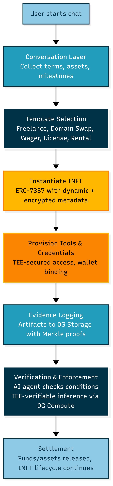
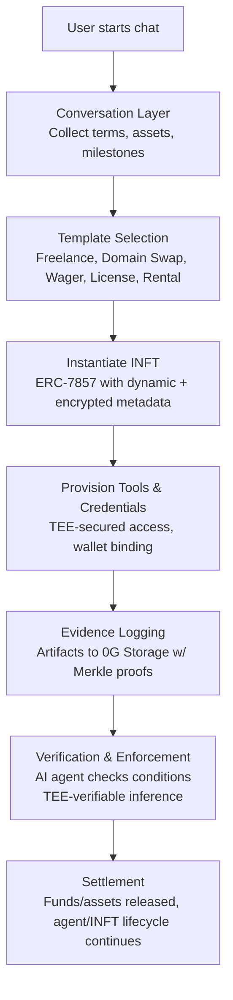

# ⚡ Pacter — Wave 5 Update

## Inference-Driven Arbitration, Productive Escrow Funds, and Time-Based Automation

*(Built on 0G Chain with iNFT Agents and Secure On-Chain Inference)*

This wave introduces a major step toward self-governing digital agreements — enabling Pacter contracts to arbitrate disputes autonomously, utilize idle escrow assets through insured DeFi vaults, and support continuous, inference-verified service payments.

### 🧱 Core Upgrades

#### 1️⃣ Arbitration-Enabled Escrow
Dispute handling is no longer an afterthought. Every escrow contract — whether milestone-based or time-locked — can now route unresolved cases to an arbitration contract address. When both parties signal disagreement, the inference agent compiles all context: signed terms, verification logs, storage hashes, and timestamps, then forwards them on-chain to the arbitration layer. This arbitration layer can connect with on-chain courts such as Kleros-style juror systems or specialized resolution contracts designed for 0G. Each case carries a full data payload, letting external protocols evaluate and release funds according to verified rulings. If no dispute arises within the set period, the contract auto-releases funds — a built-in "timeout" safeguard ensuring no value remains locked indefinitely.

*Example:*
A freelancer completes Milestone 2 for a web app project. The AI verification agent detects missing deployment files and flags a mismatch. The client disagrees and raises a dispute. Pacter's contract packages the repo hash, verification proof, and signatures, then sends them to the arbitration address. The arbiter (e.g., a 0G-based dispute contract) reviews the evidence and automatically resolves payment, updating the main escrow state.

#### 2️⃣ Time-Locked Inference Escrow
To support API rentals and compute-as-a-service, we deployed a time-based escrow mechanism. Clients pre-fund a contract for a defined duration — for example, five days of AI inference API access. The funds unlock gradually as time progresses, verified continuously by the agent testing the API endpoint's responsiveness. If the service fails or latency exceeds the SLA, the agent pauses payment in real-time. When uptime is restored, the same contract resumes without redeployment.

*Example:*
A startup offers GPU inference endpoints through Pacter. A user books 5 days of compute, depositing funds into the time-locked escrow. The AI agent periodically calls the endpoint — if 12 hours of downtime occur, the system auto-deducts the inactive duration from total payout. The client's remaining balance continues earning yield in the vault until the session resumes.

#### 3️⃣ Productive Escrow Funds via Insured DeFi Vaults
Previously, escrow deposits were idle, serving only as locked capital. Now, clients can opt-in to route escrow balances into stable, insured DeFi vaults through the integrated Pacter DeFi Vault (1%). This converts dormant deposits into yield-earning assets — generating low-risk returns during the contract lifecycle. When the escrow concludes, the contract withdraws both principal + yield, splitting profits:
- 90% to the client (fund originator)
- 10% to the freelancer (as opportunity reward)
Future iterations will integrate audited, insured vaults (Aave-style) to minimize risk while maintaining transparency.

#### 4️⃣ Inference Agents with Transaction Transparency
All milestone approvals, arbitration triggers, and vault interactions now run through inference-based on-chain commands. Each action emits a verifiable log showing which command executed the transaction — a cryptographically attested audit trail on 0G Storage. This brings deterministic explainability to every financial operation, turning the contract into a transparent, interpretable state machine.

### 🧩 Real-World Impact

| Scenario | Description |
|---|---|
| Freelance Development | Client deploys milestone escrow; agent verifies GitHub commits, manages disputes via arbitration, and auto-invests idle funds. |
| AI API Rental / Compute Access | Time-locked escrow streams payments for live services; inference monitors uptime, pauses payouts if conditions fail. |
| DeFi Yield Utilization | Escrow deposits earn passive yield via trusted vaults, enhancing capital efficiency without sacrificing safety. |
| Autonomous Arbitration | Disputes route to on-chain courts for verifiable, bias-free outcomes. |

---

### 🔗 Deployed on 0G Newton Testnet (Chain ID 16602)

| Component | Address |
|---|---|
| 🏦 Pacter DeFi Vault (1%) | [`0xa570E01A19A4bE995f5A27498b22eC6CbC2F1283`](https://chainscan-galileo.0g.ai/address/0xa570E01A19A4bE995f5A27498b22eC6CbC2F1283) |
| ⏱ Time-Locked Escrow Contract | [`0xAf80C53e4A85E5f14aB304A26aDCfEf723f610a4`](https://chainscan-galileo.0g.ai/address/0xAf80C53e4A85E5f14aB304A26aDCfEf723f610a4) |
| 💼 Milestone Escrow Contract | [`0x5845B17df53b0E3b5a9be04908294cDa8c4FA3e0`](https://chainscan-galileo.0g.ai/address/0x5845B17df53b0E3b5a9be04908294cDa8c4FA3e0) |
| 🌐 Live Demo | [pacter.vercel.app](https://pacter.vercel.app) |
| 🎥 Demo Video | [YouTube Demo](https://www.youtube.com/watch?v=zkIWkmrfOIc) |

### 🧭 Summary

Wave 5 upgrades make Pacter a fully autonomous coordination system — where:
- Every agreement can resolve disputes via verifiable arbitration.
- Idle escrow capital works productively in insured DeFi vaults.
- Continuous-service providers get paid in real time.
- Every on-chain decision is inference-verified and audit-logged.

This establishes Pacter as a trustless, yield-aware, arbitration-ready contract layer for real-world digital collaborations on the 0G Chain.


## 📦 0G WaveHack Wave 3 & 4 Updates

### Wave 3 & 4: Enhanced Web Development Verification Escrow with Jurisdictional Legal NFTs

We've significantly evolved Pacter from a simple escrow system to a comprehensive web development verification platform with jurisdictional legal backing. The platform now features a sophisticated multi-stage workflow with proper UX, leveraging 0G's powerful infrastructure for secure, transparent, and verifiable digital agreements.

#### 🚀 Transformative Evolution Process

Our journey from Wave 2 to Waves 3 & 4 represents a fundamental shift in how digital agreements are created, verified, and enforced:

**From Simple Escrow to Comprehensive Verification Platform:**
We've transformed the basic escrow functionality into a full-fledged verification system that handles the entire web development workflow. This evolution addresses the critical trust gap in freelance web development by providing automated verification of deliverables, secure milestone payments, and legally binding agreements.

**Jurisdictional Legal Framework Integration:**
We've pioneered the integration of jurisdiction-specific legal frameworks through our Indian Legal Contract NFT (INFT). This groundbreaking approach ensures that digital agreements have proper legal standing within specific jurisdictions, bridging the gap between blockchain technology and traditional legal systems.

**Multi-Stage Verification Workflow:**
Our enhanced system now features a sophisticated multi-stage verification process:
1. **Information Collection** - Gathering project requirements, milestones, and payment terms
2. **Contract Creation** - Generating legally binding agreements through our INFT framework
3. **GitHub Integration** - Connecting to repositories for automated code verification
4. **Code Extraction & Analysis** - Pulling and analyzing code changes for milestone verification
5. **Client Review & Approval** - Enabling clients to review deliverables and approve payments
6. **Secure Payment Release** - Automated milestone payments upon verification and approval

**0G Infrastructure Utilization:**
We've deeply integrated 0G's powerful infrastructure throughout our platform:
- **0G Storage** - All contract data, code artifacts, and verification proofs are securely stored with immutable hashing
- **0G Compute** - AI-powered contract analysis and verification through secure TEE-verified computation
- **0G Chain** - Smart contract deployment for escrow management and payment processing

#### 🌟 Major Advancements

1. **Deployed Indian Legal Contract NFT (INFT)** - A legally binding digital contract framework specifically designed for the Indian jurisdiction, enabling enforceable freelance agreements with proper legal standing. The contract includes all necessary legal clauses, jurisdiction-specific provisions, and is minted as an NFT with immutable proof of existence.

2. **Enhanced Verification Workflow** - A multi-stage process that collects, verifies, and validates web development deliverables through GitHub integration, with automated code extraction and analysis. The system pulls code from repositories, analyzes changes, and generates verification proofs that are stored on 0G Storage.

3. **0G Storage Integration** - All code and verification artifacts are securely stored on 0G Storage with immutable proofs, ensuring transparency and auditability. Each verification step generates cryptographic proofs that are stored alongside the original data, creating an unalterable record of the entire process.

4. **0G Compute Inference** - AI-powered contract analysis and amendment generation through secure TEE-verified computation. Our system uses advanced language models to analyze contracts, suggest amendments, and verify deliverables, all running in secure enclaves with cryptographic attestation.

5. **Deal Maker Smart Contract** - A sophisticated escrow system acting as an autonomous middleman agent for secure deposits and AI-agent-approved milestone payments. The contract holds funds, releases payments based on verification results, and maintains a complete audit trail of all transactions.

6. **Multi-Page UX Flow** - Redesigned user experience with clear stage indicators, proper information collection, and streamlined verification processes. The interface guides users through each step of the process, from contract creation to final payment, with intuitive navigation and real-time status updates.

### 📋 Project Information

| Component | Details |
|-----------|----------|
| **Indian Legal INFT Agent** | [`0x50AfCE3f4C6235bAbFbCD31C8Dd1693E99046705`](https://chainscan-galileo.0g.ai/address/0x50AfCE3f4C6235bAbFbCD31C8Dd1693E99046705) |
| **TEE Verifier Contract** | [`0x81bCd9AbdD3eCd4878AeB98b947f61ACa98b9288`](https://chainscan-galileo.0g.ai/address/0x81bCd9AbdD3eCd4878AeB98b947f61ACa98b9288) |
| **IndiaFreelanceLegalNFTImpl** | [`0x9c38E1045Cf3b499199075bbC4E438E4faF900aB`](https://chainscan-galileo.0g.ai/address/0x9c38E1045Cf3b499199075bbC4E438E4faF900aB) |
| **IndiaFreelanceLegalNFTBeacon** | [`0x2B31469af35BE50E233Df01F0944dA3203b7e456`](https://chainscan-galileo.0g.ai/address/0x2B31469af35BE50E233Df01F0944dA3203b7e456) |
| **Minted Agent Token ID** | [Token #0](https://chainscan-galileo.0g.ai/tx/0x6b32607d05d29c4f74fa27d5666449a8e60bf93cc5366e7bbcf3708ee34ecb52) - Owner: `0x83CDBbA8359aAc6a25ACb70eb67dcF0E5eB2c607` |
| **Escrow Contract (PacterEscrowV2)** | [`0x259829717EbCe11350c37CB9B5d8f38Cb42E0988`](https://chainscan-galileo.0g.ai/address/0x259829717EbCe11350c37CB9B5d8f38Cb42E0988) |
| **Network** | 0G Newton Testnet (Chain ID: 16602) |
| **Demo Video** | [https://www.youtube.com/watch?v=ckIWzmrfOIc](https://www.youtube.com/watch?v=ckIWzmrfOIc) |
| **Live Demo** | [https://pacter.vercel.app/](https://pacter.vercel.app/) |

---


# 🟦 Pacter – Programmable Trust Protocol

> **Autonomous agreements. Verifiable enforcement. No intermediaries.**
>
> Next.js/yarn · Powered by 0G Compute, Storage & Chain

---

## 🚀 Overview

**Pacter** enables anyone to create, manage, and enforce digital pacts using autonomous AI agents. These agents are deployed as Intelligent NFTs (INFTs) on the 0G blockchain, combining on-chain security, transparent AI-powered logic, and tamper-proof storage for digital agreements.

Whether for freelance work, domain trades, digital wagers, IP licensing, or rentals, Pacter gives everyone instant access to programmable trust—no more relying on centralized platforms or human middlemen.

---

## 📊 Architecture & Flow



### **How it works at a glance:**
1. **User starts chat:** Contract terms, assets, milestones are gathered conversationally.
2. **Template selection:** The best-fit agent template is chosen: e.g., Freelance, Wager, Domain Swap, License, Rental.
3. **INFT instantiation:** ERC-7857 INFT created with dynamic, encrypted agent metadata.
4. **Agent provisioning:** TEE-secured credentials/tools, linked wallet.
5. **Evidence logging:** Every artifact to 0G Storage (with Merkle proofs for transparency).
6. **Enforcement:** AI agent validates evidence, enforces logic—all TEE-verifiable via 0G Compute.
7. **Settlement:** Funds/assets are auto-released; the INFT lifecycle continues, ready for re-use or transfer.

---

## 🛠️ **Quickstart (for Devs)**

### **1. Clone & Install**

```bash
git clone https://github.com/YOUR-ORG/pacter.git
cd pacter
yarn install
```

### **2. Environment Setup**

- Copy `.env.example` to `.env.local` and fill in required values:
  - `NEXTAUTH_SECRET=`
  - `NEXT_PUBLIC_0G_PROJECT_ID=`
  - `NEXT_PUBLIC_INF_PROVIDER_URL=`
  - `0G_CHAIN_RPC=`
  - ...see `.env.example` for details.

### **3. Start the Dev Server**

```bash
yarn dev
```

---

## 🌐 **What Pacter Enables**

- **Trustless escrow, payouts, and asset transfers.**
- **AI-enforced contract verification.**
- **Custom, templatized contract logic—deploy new agent logic without a full redeploy.**
- **Audit logs, evidence, and agent outputs are stored on-chain/off-chain with privacy and immutability.**

---

## 💡 **Hero Use Cases (Deep Dive)**

### 1. **Freelance Milestone Contracts**
- **Pain Point:** Freelancers/clients want milestone payouts without Upwork/Fiverr.
- **Pacter Solution:**  
  1. User defines milestones and evidence method (e.g., GitHub commits).
  2. Funds deposited up front in an INFT vault.
  3. AI agent checks milestones as work is submitted, releases partial payouts per milestone.
  4. All proofs/evidence are logged to 0G Storage, audit-ready.
- **Innovation:** Automated milestone validation, support for web/code/file proofs, no platform take rate.

---

### 2. **Domain/Asset Swaps**
- **Pain Point:** Safe, peer-to-peer domain transfers require costly brokers.
- **Pacter Solution:**
  1. Buyer deposits payment; seller transfers asset (domain, license, code).
  2. Agent (with oracle/plugins) verifies transfer and registry status.
  3. On success, swaps assets/funds.
- **Innovation:** Agent-controlled account (e.g., TEE-owned GitHub for code transfers), end-to-end on-chain finality.

---

### 3. **Peer-to-Peer Wagers**
- **Pain Point:** Trustless online betting usually involves custodians or opaque platforms.
- **Pacter Solution:**
  1. Any user creates a social wager (anything verifiable online).
  2. Counterparties deposit stakes into a pooled contract.
  3. Agent verifies outcome via oracle/screenshots/API and pays out winner.
  4. Wage template creators can be rewarded a protocol fee.
- **Innovation:** Extensible wager templates, open to the world, with shareable/tunable logic.

---

### 4. **Digital Licensing/Royalties**
- **Pain Point:** Managing digital rights, license expiry, and royalties is manual and often unenforced.
- **Pacter Solution:**
  1. Artists/owners mint license agents as INFTs.
  2. Agents handle access, verify usage/event triggers, and automatically split/stream royalties.
- **Innovation:** Programmable license logic, cross-market enforcement, all with audit trails.

---

### 5. **NFT/Asset Rentals**
- **Pain Point:** Borrowing/lending NFTs is risky—time-based or "return" enforcement is hard.
- **Pacter Solution:**
  1. Asset is custodied in the INFT vault for a fixed term.
  2. Renter pays; access is given/revoked via agent logic.
  3. Agent ensures timely return (or clawback)—all conditions enforced.
- **Innovation:** Time-based, automated access management, programmable for any digital property.

---

### **More Possible Verticals**
- API quota management, SaaS subscriptions, gaming rewards, hackathon bounties, group fundraising, digital event ticketing, data exchange deals, influencer marketing, online learning credentialing, etc.

---

## 🧑‍💻 **Core Technology Stack**

- **Next.js + Tailwind CSS:** Fast, modern frontend.
- **LangGraph:** Open-source agent orchestration for conversational intake and branching flows.
- **0G Compute SDK:** TEE-backed LLM/AI agent execution, inference, and audit.
- **0G Storage SDK:**  
  - **Log Layer:** Write-only event logs for full transparency.  
  - **KV Layer:** Efficient, updatable contract/session objects.
- **INFTs (ERC-7857 / thirdweb):** Tokenized, programmable agents powered by upgradable logic, workflow templates, and secure access controls.
- **EVM Contracts:** For custody, settlement, vaults, and pooled agreement types.
- **WalletConnect:** User wallet authentication and transactions.
- **IPFS:** Redundant, decentralized storage for logs/assets.

---

## 🔐 **How Does 0G Compute/Storage Enable Pacter?**

- **0G Compute:**  
  - Every mission-critical AI operation runs on encrypted TEE-nodes (enclaves).
  - Output is cryptographically attested: Users, auditors, or counterparties can always verify the output was real.
  - Supports public, fine-tuned, or custom models (OpenAI, Llama, Deepseek, etc).
  - Pay-as-you-go inference, batching, and upcoming subscription support.

- **0G Storage:**  
  - All contract metadata, agent state, user evidence, and logs live in append-only blobs or efficient key-value stores.
  - Merkle proofs and version hashes enable instant audit, historic replay, and deletion protection.
  - Sensitive files/private terms encrypted, public logs/proofs open (privacy by design).
  - Full SDKs in Go and TypeScript for dev extensibility.

---

## 🔍 **Process Flow (in Detail)**



---

## 📈 **Development Roadmap & Achievements**

### **Wave 1: Foundation** ✅
- Robust chat onboarding with AI-powered contract generation
- Wallet connect integration (WalletConnect)
- Demo flows live (freelance contracts, escrow)
- Public, open-sourced codebase and detailed GitHub docs

### **Wave 2: Core Escrow System** ✅
- Basic escrow contract deployment on 0G testnet
- Simple milestone-based payment system
- Initial INFT agent integration
- Protocol fee structure implementation

### **Wave 3: Indian Legal Compliance & Advanced Verification** ✅

#### **Indian Freelance Legal INFT Agent**
We deployed a specialized INFT agent contract specifically designed for Indian jurisdiction freelance agreements, incorporating:

**Legal Framework Integration:**
- **Indian Contract Act, 1872** compliance
- **Information Technology Act, 2000** digital signature support
- **Arbitration & Conciliation Act, 1996** dispute resolution
- Multi-currency support: INR, Cryptocurrency (VDA), and lawful barter
- Tax compliance clauses (Section 28, Income Tax Act, 1961)
- Escrow and smart contract automation clauses
- AI-powered dispute resolution with legal fallback mechanisms

**INFT Contract Deployment (zgTestnet):**

| Contract | Address | Purpose |
|----------|---------|---------|
| **TEEVerifier** | [`0x81bCd9AbdD3eCd4878AeB98b947f61ACa98b9288`](https://chainscan-galileo.0g.ai/address/0x81bCd9AbdD3eCd4878AeB98b947f61ACa98b9288) | TEE-based proof verification for agent actions |
| **IndiaFreelanceLegalNFTImpl** | [`0x9c38E1045Cf3b499199075bbC4E438E4faF900aB`](https://chainscan-galileo.0g.ai/address/0x9c38E1045Cf3b499199075bbC4E438E4faF900aB) | Implementation contract for upgradeable INFT |
| **IndiaFreelanceLegalNFTBeacon** | [`0x2B31469af35BE50E233Df01F0944dA3203b7e456`](https://chainscan-galileo.0g.ai/address/0x2B31469af35BE50E233Df01F0944dA3203b7e456) | Beacon proxy for upgradeable pattern |
| **IndiaFreelanceLegalNFT** (Main) | [`0x50AfCE3f4C6235bAbFbCD31C8Dd1693E99046705`](https://chainscan-galileo.0g.ai/address/0x50AfCE3f4C6235bAbFbCD31C8Dd1693E99046705) | Main INFT contract for legal agent instances |

**Minted Agent Instance:**
- **Token ID:** 0
- **Owner:** `0x83CDBbA8359aAc6a25ACb70eb67dcF0E5eB2c607`
- **Transaction:** [`0x6b32607d05d29c4f74fa27d5666449a8e60bf93cc5366e7bbcf3708ee34ecb52`](https://chainscan-galileo.0g.ai/tx/0x6b32607d05d29c4f74fa27d5666449a8e60bf93cc5366e7bbcf3708ee34ecb52)
- **Status:** ✅ Active with TEE-verified proofs

**Legal Prompt Integration:**
The INFT agent uses a comprehensive legal prompt ([view source](./Pacter-NFT-main/scripts/mint/storageIntegration.ts)) that:
- Reviews and audits user-provided contracts
- Adds Indian law compliance clauses
- Incorporates payment, escrow, and dispute resolution terms
- Ensures jurisdiction-specific requirements are met
- Generates legally robust, structured agreements

**0G Compute Integration for Legal Processing:**
- **Model:** Llama-3.3-70B-Instruct (TEE-verified)
- **Provider Address:** `0xf07240Efa67755B5311bc75784a061eDB47165Dd`
- **Purpose:** Process initial contracts, add legal amendments, ensure compliance
- **Verification:** All AI inference runs in TEE (TeeML) for cryptographic attestation

### **Wave 4: Production-Grade Escrow with Full Verification** ✅

#### **Enhanced Escrow Smart Contract**
Upgraded from simple escrow to a comprehensive verification-based system:

**PacterEscrowV2 Contract:**
- **Address:** [`[To be filled]`](#)
- **GitHub:** [View Contract Source](./contracts/PacterEscrowV2.sol)
- **Features:**
  - Multi-milestone support
  - AI agent verification integration
  - Automated payment approval workflow
  - 0G Storage fee handling
  - Dispute resolution states
  - TEE-verified deliverable checking

**Contract States:**
```
PENDING → ACTIVE → VERIFIED → APPROVED → COMPLETED
                ↓
         VERIFICATION_FAILED / DISPUTED
```

#### **Complete Verification Workflow**

**1. Information Collection Stage**
- Multi-page UX for gathering project details
- AI-powered chat interface for natural contract creation
- Milestone definition with deliverable requirements
- Payment terms and escrow amount configuration

**2. Contract Generation & Signing**
- AI generates legally compliant contract using INFT agent
- Both parties review and digitally sign
- Signatures stored on-chain with timestamps
- Contract metadata uploaded to 0G Storage

**3. Escrow Deposit**
- Client deposits funds to smart contract
- Amount split: Escrow (90%) + Storage Fee (10%)
- Order hash generated for tracking
- Funds locked until verification complete

**4. Deliverable Submission & Verification**
The system implements a comprehensive verification pipeline:

**GitHub Verification Module:**
- Freelancer submits GitHub repository URL
- System verifies repository accessibility
- Checks commit history and authenticity
- Auto-detects deployment URLs from repository metadata
- Validates deployment connection to repository

**Code Download & Storage:**
- Repository cloned and packaged
- Metadata JSON created with verification details
- **Uploaded to 0G Storage** (real decentralized storage)
- Root hash and transaction hash returned
- All artifacts immutably stored

**AI Agent Verification:**
- Agent reviews code quality and completeness
- Checks against milestone requirements
- Verifies deployment matches repository
- **Signs verification on-chain** using TEE-secured wallet
- Verification details stored in smart contract

**5. Client Review & Approval**
- Client can test live deployment URL
- Reviews AI verification report
- Sees complete audit trail
- Approves payment release on-chain
- Approval triggers state change to APPROVED

**6. Freelancer Withdrawal**
- Freelancer withdraws funds from escrow
- Smart contract transfers approved amount
- Storage fees sent to 0G service wallet
- Contract state updated to COMPLETED
- All transactions recorded on-chain

#### **0G Integration Highlights**

**0G Storage Usage:**
1. **Contract Metadata Storage**
   - Legal contracts and terms
   - Party information and signatures
   - Milestone definitions

2. **Verification Artifacts**
   - GitHub repository snapshots
   - Deployment verification proofs
   - AI agent assessment reports
   - Merkle proofs for audit trail

3. **Evidence Logging**
   - All deliverable submissions
   - Client feedback and comments
   - Dispute resolution records
   - Complete transaction history

**0G Compute Usage:**
1. **Legal Contract Processing**
   - Initial contract review and enhancement
   - Indian law compliance checking
   - Clause insertion and formatting
   - Legal audit log generation

2. **Deliverable Verification**
   - Code quality assessment
   - Milestone completion checking
   - Deployment validation
   - Automated decision-making

3. **Dispute Resolution**
   - Evidence analysis
   - Automated mediation suggestions
   - Fair settlement recommendations

**INFT Agent Integration:**
- Each contract can be backed by an INFT agent
- Agent holds verification logic and legal templates
- TEE-secured credentials for GitHub/API access
- Upgradeable logic via beacon proxy pattern
- Transferable and composable agent instances

#### **Technical Architecture**

**Frontend (Next.js):**
- Multi-stage contract creation flow
- Real-time verification progress tracking
- Wallet integration (WalletConnect)
- Contract state visualization
- Chat interface for AI interaction

**Backend (API Routes):**
- `/api/contracts` - Contract CRUD operations
- `/api/verify/github` - GitHub verification
- `/api/verify/storage` - 0G Storage upload
- `/api/verify/agent-sign` - AI agent signing
- `/api/verify/finalize` - Backend state update
- `/api/storage/download` - 0G Storage download

**Smart Contracts:**
- PacterEscrowV2 - Main escrow logic
- IndiaFreelanceLegalNFT - INFT agent instances
- TEEVerifier - Proof verification

**Storage Layer:**
- Redis - Fast contract state management
- 0G Storage - Immutable artifact storage
- IPFS - Redundant backup storage

### **Wave 5: Future Enhancements** 🚀
- Multi-party agreements and group contracts
- Cross-chain asset support
- Autonomous agent self-upgrades
- Community-contributed templates
- Advanced analytics and reporting
- Mobile app development
- Integration with traditional legal systems

---

## 🤝 **Contribute / Build**

- Fork this repo, read our [dev docs](https://github.com/YOUR-ORG/pacter/tree/main/docs), and start customizing templates!
- Submit INFT agent templates for any repeatable agreement—they're composable, ownable, and rewardable.
- File PRs/issues or reach out for partnership opportunities.

---

## ⚡ **Summary**

Pacter is **not another dApp—it's the next trust primitive**:  
A protocol, toolkit, and ecosystem for AI-enforced, programmable agreements—autonomous, composable, audit-ready, and open to all.

For anything from a two-person wager to a global software license, **Pacter and 0G unlock the future of digital collaboration.**

***Build on trust, not on hope.***

---

**Explore more on our [GitHub](#) and dive into the future of programmable digital pacts!**
